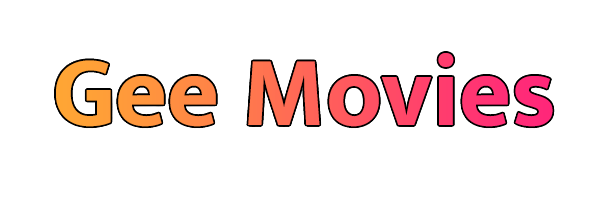

  
  
## Gee Movies
  Um site inspirado em um streaming, onde você poderá assistir aos trailers dos ultimos filmes que foram lançados. Esse projeto surgiu após ver os desafios do [Iuri Silva](https://www.linkedin.com/in/iuricode/), pois vi um desafio que era a página de um site de filmes e outro uma tela de login. Então pensei em juntar os dois desafios em apenas um, então surgiu esse projeto.

## Tecnologias
  * HTML
  * CSS
  * Javascript
  * JQuery
  * Firebase
  * [TMDB](https://www.themoviedb.org/) - (The Movie Database) V.3
  * [Swiper](https://swiperjs.com/) - (Para criação do slider)

## Funcionalidades
  * Cadastro de novos usuários ✅
  * Login de usuários ✅
  * Recuperar senha ✅
  * Criação de diversos perfis ✅

## Status
  Em andamento...

## Autor
  **Lucas Vieira Veras**

  #### [LinkedIn](https://www.linkedin.com/in/lucas-vieira-dev/)
  #### [E-mail](mailto:lukasveras14@gmail.com)
